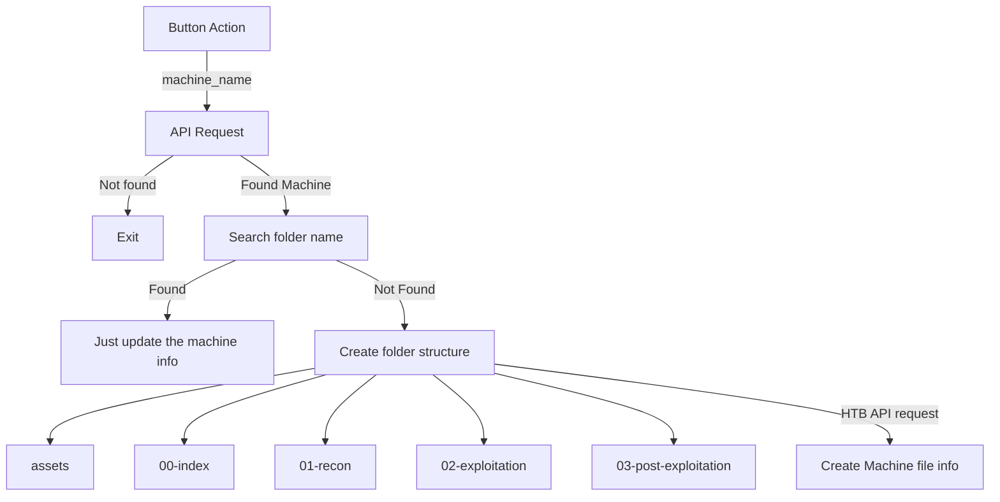
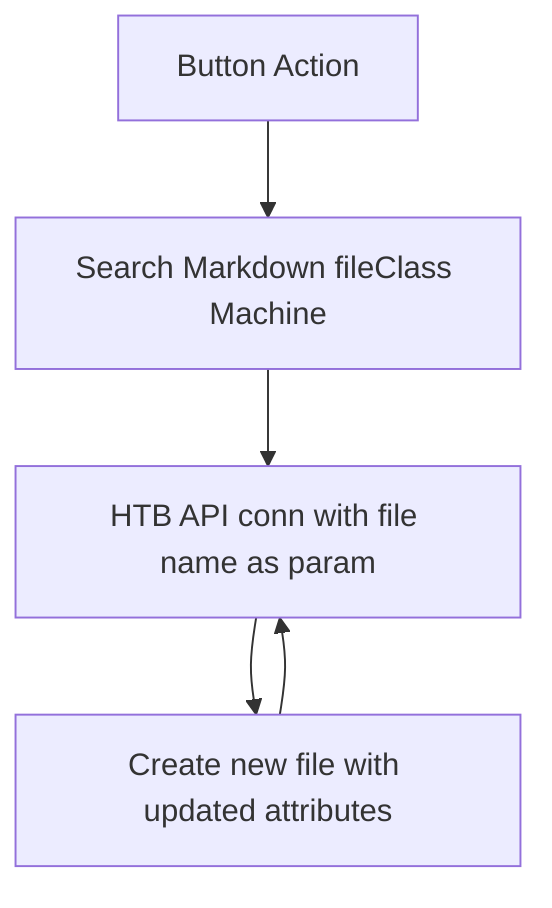

## Script Workflow  for  - Create Machine Note

*This is simple button that will automate the creation of starting notes that will improve your quality of pwn. Just click on it and select the name of the machine you would like to compromise.*




```button
name Create Machine Note
type link
action obsidian://shell-commands/?vault=HTB&execute=m6e17y5rts
templater true
color blue
```


---------------------

## Script Workflow  for  - Update Machines info
*As you can see in the diagram below, you can update the machine info of all the machines that has its folder name under /Machines folder*




```button
name Update Machines info
type link
action obsidian://shell-commands/?vault=HTB&execute=usnoddh2no
templater true
color blue
Custom Class custom-buttom
```


