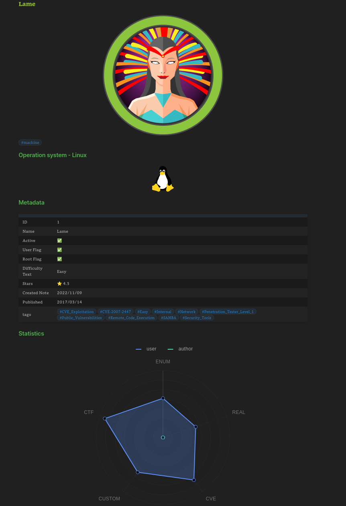
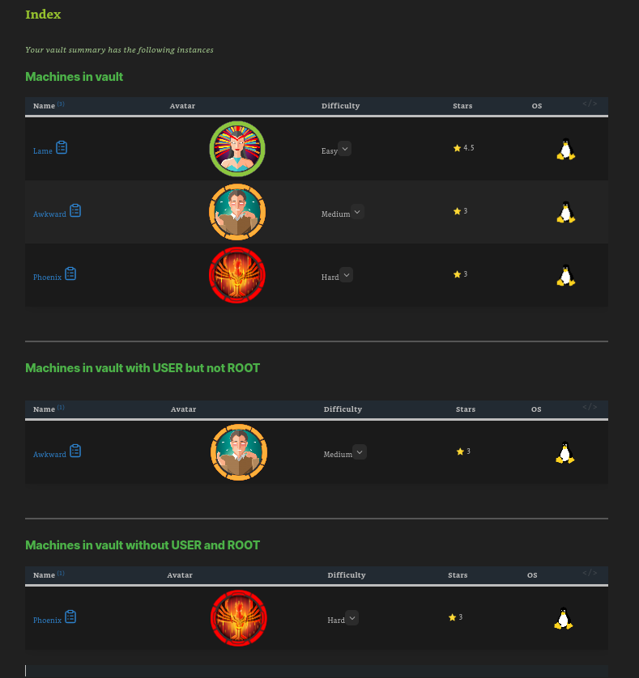
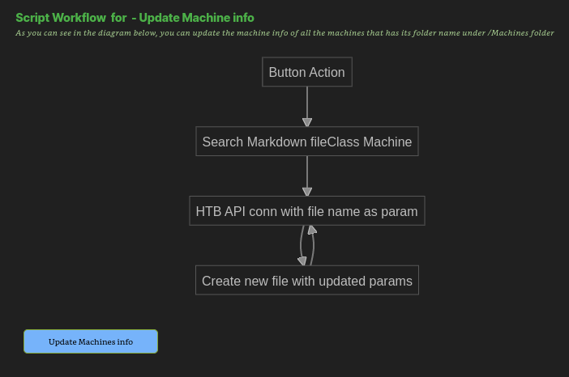

# HTNotes


HTNotes is a powerfull automatic tool that integrates a Vault Workspace in `Obsidian`. It can automate the first steps of taking Notes in a HTB Machine by generating a folder structure  given a machine name. It has also an integration with the HTB API that makes requests and print the info into markdown files.

This can be performed with just a click on obsidian button. 

## Table of Contents

- [Content](#Content)
- [Setup](#Setup)
- [Usage](#Usage)
- [References](#References)
## Content

Nothing except your eyes could 


https://user-images.githubusercontent.com/48086822/200939575-04219c6f-0686-43a7-985f-18e30c4b2756.mp4


## Setup

### Install obsidian
You need Obsidian to integrate the tool.

Open your browser and go to [Download Obsidian](https://obsidian.md/download).
Install .deb and execute the following command under Dowloads

```
sudo dpkg -i <<Obsidian.deb>>
```

### Clone the repo
Now you need to clone this repository and install all the dependencies.  

```
git clone https://github.com/0x4xel/HTNotes
cd HTNotes
pip install -r requirements.txt
```

### Get App token in HackTheBox

1. You have to login in [HackTheBox](https://www.hackthebox.com/). 
2.  Explore under View Profile -> Profile Settings -> App Tokens -> Generate App token
3.  Create a token that will be needed to make requests on HTB API.

### Put token in Constants.py

Put you API key in Constants.py file and save.

### Open you Vault folder

1. Open obsidian and select *open existing vault*
2. Select the folder HTB under HTNotes
3. IMPORTANT: When prompt open asking for permisions, press enable. This vault has preconfigured plugins that is needed to work properly

Note: Consider that HTB folder will be the main vault folder, so scripts must be under HTNotes and with execute privileges with current user to keep working.


## Usage

#### Machine info

When the script creates a machine folder, it also creates a fileClass call "machine" that receive the data from the API and print it into the {{machine_name}}.md.

The profile of the machine is displayed like:



#### Index 

There are three *dynamic tables* that will show you the diferent machines in the vault. Machines fileClass are defined by the tag "machine".

This tables :
1. Show all the machines in the vault
2. Show the machines in the vault that have user flag but not root flag
3. Show the machines in the vault that have not started




#### Create Machine Note

This is the main funtion of the integration. "Create Machine Note" button calls `htb_api.py` and makes all the implementation given below in the flowchart


#### Update Machine Info

This button is usefull trigger it when you have completed a machine, or you didnt access to HTB in a while. This button will ONLY update the machine info of all the machines you have in the vault, updating the state of flags and graphs.



## References

https://github.com/clubby789/htb-api 
With the support of xerosec team https://discord.gg/cZPaRurR  ❤️
