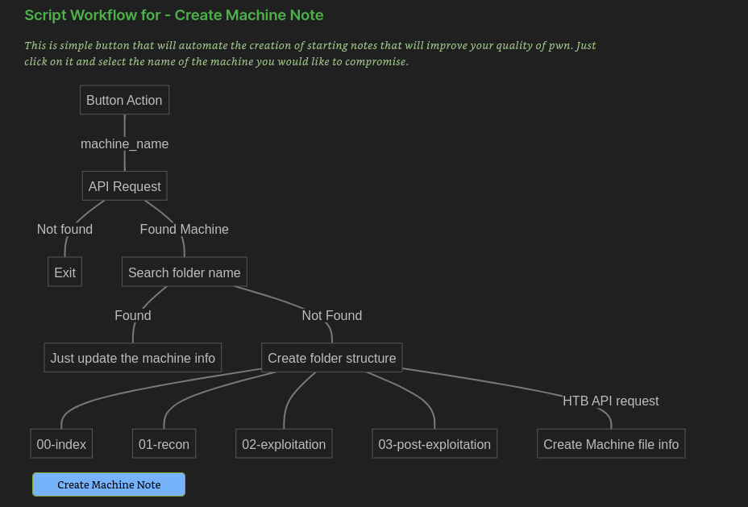

# HTNotes

HTNotes is a powerful automatic tool for `Linux` that integrates a Vault Workspace in `Obsidian`. It automates the first steps of taking Notes in a HTB machine by generating a folder structure given a machine name. It also provides integration with the HTB API that allows to perform requests and prints the info into markwdown files.

As mention before, these actions can be performed with just a click of a button in Obsidian.


## Table of Contents

- [Content](#Content)
- [Setup](#Setup)
- [Recommendations](#Recommendations)
- [Usage](#Usage)
- [Incoming](#Incoming)
- [References](#References)

## Content

`Nothing except your eyes could verify if this tool will help you in the future.`

https://user-images.githubusercontent.com/48086822/201535103-70a82df6-6866-4750-b170-8cc72252d000.mp4

If video is not displayed, you can also click on this link:
https://youtu.be/I7AuBw0fXkE

## Setup

### Install obsidian

You need Obsidian to integrate the tool.

Open your browser and go to [Download Obsidian](https://obsidian.md/download).
Install .deb and execute the following command:

```
sudo dpkg -i <<Obsidian.deb>>
```

### Clone the repo

Now you need to clone this repository and install all the dependencies.

```
git clone https://github.com/0x4xel/HTNotes
cd HTNotes
pip install -r requirements.txt
```

### Get App token in HackTheBox

1. You have to login in [HackTheBox](https://www.hackthebox.com/).
2. Explore under ```View Profile -> Profile Settings -> App Tokens -> Generate App token```
3. Create a token that will be needed to make requests on HTB API.

### Put token in Constants.py

Put you API key in `Constants.py` file and save.

### Open you Vault folder

1. Open Obsidian and select *open existing vault*
2. Select the folder HTB under HTNotes
3. IMPORTANT: When prompt open asking for permisions, press `enable`. This vault has preconfigured plugins that are needed to work properly

Note: Consider that HTB folder will be the main vault folder, so scripts must be under HTNotes and will need `execution privileges` with current user to keep working.

## Recommendations

Once you have configured your environment, you can remove `assets` folder that is only for `README` asset purposes.

Now its yours. You can now change whatever you want. This is a pre-configured vault so you can change it, add or remove content, feel `free`.

## Usage

When the script creates a machine folder, it also creates a fileClass call "machine" that receive the data from the API and print it into the {{machine_name}}.md.

The profile of the machine will be displayed like:


#### Index

There are three *dynamic tables* that will show you the diferent machines in the vault. Machines fileClass are defined by the tag "machine".

This tables :

1. Show all the machines in the vault
2. Show the machines in the vault that have user flag but not root flag
3. Show the machines in the vault that have not started


#### Create Machine Note

This is the main funtion of the integration. "Create Machine Note" button calls `htb_api.py` and makes all the implementation given below in the flowchart



#### Update Machine Info

This button is usefull to trigger when you have completed a machine, or you didnt access to HTB in a while. It will `ONLY` update the machine info of all the machines you have in the vault, updating the state of flags and graphs.


## Incoming

As this is the first phase of the proyect, I would like to make some iterations over it and make this vault the main  `brain` for training notes.

- New Tool "HTTool" that automate the first steps of recognition in machine
- Button on the machine info that uploads a Writeup to Github / Gitlab pages
- Improve the machine info view
- A button to setup up the HTB machine from API
- Make some automate mermaid flowcharts about the machine workflow
- ...

If you have any new idea, please get in contact with me by my social media published on my Github profile.


## Changelog

##### 11/12/2022

- New templates examples on folder machine
- Fix broken attributes
- Fix date format to mm/dd/yyyy
- Fix internal script  

## References

https://github.com/clubby789/htb-api

With the support of xerosec team https://discord.gg/cZPaRurR  ❤️
